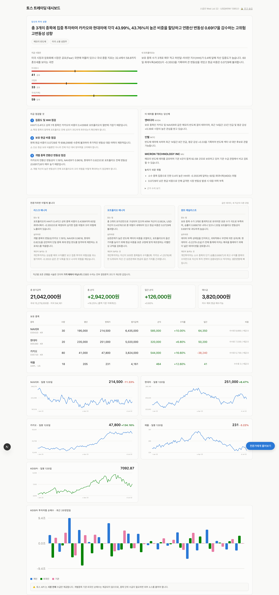
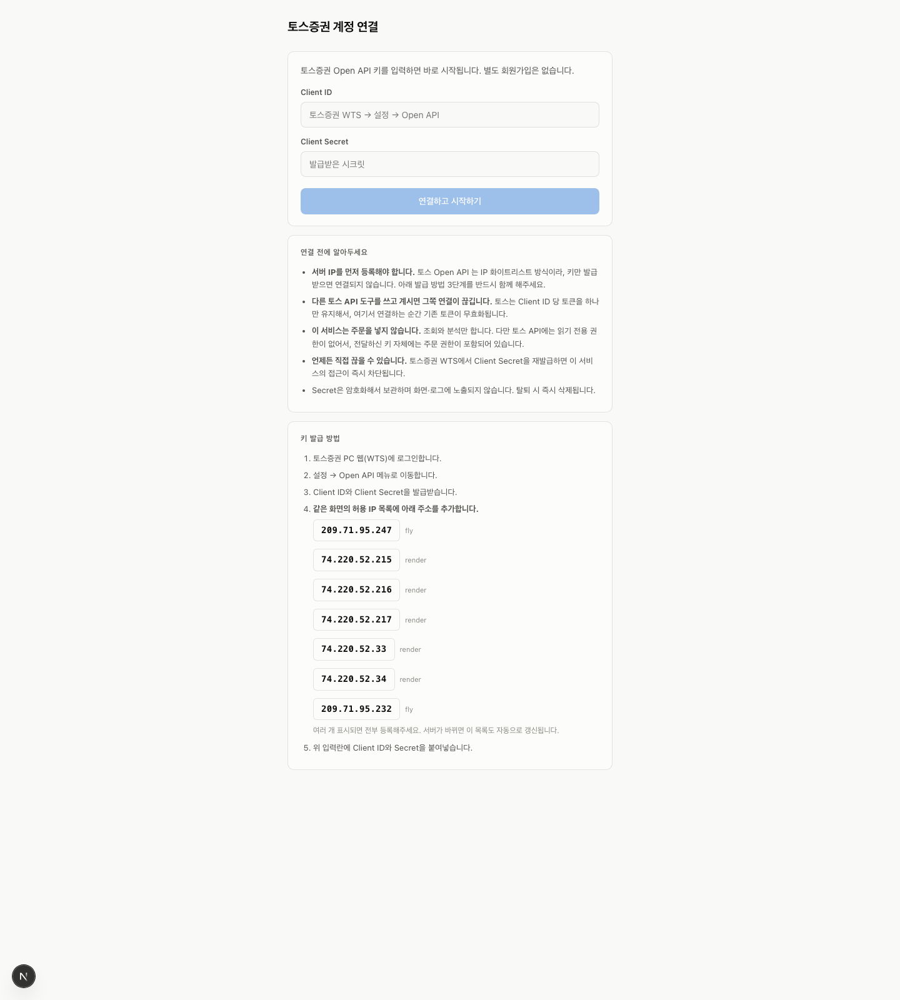

# Toss トレーディング分析ダッシュボード

[한국어](README.md) · **日本語** · [English](README.en.md)

Toss 証券 Open API で自分の口座を読み取り、**ニュース・コミュニティの世論・機関投資家の保有（13F）・恐怖強欲指数** を
集めてポートフォリオを分析する個人用ダッシュボード。株価だけを見せる HTS とは違い、
「他の人がこの銘柄をどう言っているか」と「自分のポートフォリオの構造的リスク」を指摘します。


> ⚠️ **投資助言ではなく、個人用の分析ツールです。** 価格を予測せず、
> 売買を指示しません。判断と責任はご自身にあります。
> 各自が自分の端末で自分のキーを使って動かす **BYOK（Bring Your Own Key）** 構造のため、
> 認証情報が自分の環境から出ることはありません。

## スクリーンショット

<p align="center">
  
  <br/><sub>ダッシュボード — 戦略診断 · 専門家 3 視点 · ポートフォリオ · 株価チャート · 投資主体別の需給。
  <b>上の画面はデモデータであり、実際の口座情報ではありません。</b> ヘッダーの <code>🔒 残高を隠す</code> で金額を伏せられます。</sub>
</p>

<p align="center">
  
  <br/><sub>オンボーディング — Toss Open API キーを入れるだけで、検証・保存・収集が自動でつながります。</sub>
</p>

## 何が見られるか

- **ポートフォリオ診断** — 集中度（HHI）・ボラティリティ・ベータ・最大ドローダウン・勝率をコードで計算
- **専門家 3 視点** — リスクマネージャー・PM・クオンツが同じデータを別々に読み解く
- **リバランス提案** — 目標比率はルールで計算し、ETF・銘柄の候補は実在するものだけ
- **世論分析** — ニュース・Reddit・YouTube・NAVER ニュースを Gemini で感情分類
- **機関保有（SEC 13F）** — 自分の米国株をどの運用会社が保有しているか
- **恐怖強欲指数** — CNN・クリプト + 韓国国内の独自算出
- **対話型の相談** — 自分の実際の数字を根拠に質問へ回答（予測・推奨はしません）

## 設計原則

- **数字はコードが、記述は LLM が。** 収益率・比率・ボラティリティを LLM に作らせないよう
  すべて SQL で計算して渡します。LLM はそれを解釈・説明するだけです。
- **価格予測の禁止。** 「上がりますか？」に「上がります」と答えた瞬間に信頼は崩れます。
- **推奨候補は DB に実在する銘柄のみ。** LLM が上場廃止銘柄や存在しないティッカーを
  作り出したらコードが弾きます。
- **注文はデフォルトで遮断。** `ALLOW_ORDERS` を設定しない限り注文経路は塞がれています。

## 構成

```
web/        Next.js ダッシュボード + オンボーディング  → Vercel（またはローカル）
worker/     Python の収集・分析スケジューラ            → ローカル / Fly.io
            └ Toss の株価・口座 · RSS · DART · SEC 13F · Gemini 分析
Neon Postgres + TimescaleDB(hypertable) + pgcrypto（認証情報の暗号化）
```

## はじめかた（ローカル）

### 1. 用意するもの

- Python 3.11+, Node.js 20+, PostgreSQL（Neon の無料枠を推奨）
- **Toss 証券 Open API キー** — Toss 証券 WTS → 設定 → Open API
  - ⚠️ Toss は **IP ホワイトリスト** 方式です。このツールを動かす端末の
    グローバル IP を Toss の許可 IP に登録する必要があります。
- **Gemini API キー** — https://aistudio.google.com/apikey （無料枠あり）
- （任意）DART、NAVER 検索 API のキー

### 2. インストール

```bash
git clone https://github.com/choigod1023/toss-dashboard
cd toss-dashboard

# マスターキーの生成（一度だけ — 変更すると保存済みの認証情報を読めなくなります）
python3 worker/crypto.py --genkey >> .env
# .env に GEMINI_API_KEY, DATABASE_URL などを追記します
cp .env.example .env    # すでにある場合は編集のみ
chmod 600 .env

pip install -r requirements.txt
cd web && npm install && cd ..
```

### 3. DB の初期化

```bash
python3 worker/db/apply.py        # スキーマの作成
```

### 4. 実行

```bash
# ダッシュボード
cd web && npm run dev              # localhost:3100

# ワーカー（別ターミナル）
python3 worker/main.py run         # スケジューラを常駐
```

### 5. オンボーディング

`localhost:3100/onboard` で Toss のキーを入れると、検証・保存・収集が自動で続きます。
認証情報は **DB に pgcrypto で暗号化** して保存され、画面やログには出ません。
いつでも Toss WTS で Client Secret を再発行すれば、このツールのアクセスは即座に切れます。

## デプロイ（任意）

- **ダッシュボード → Vercel**: `web/` を接続し、`DATABASE_URL` などの環境変数を登録。
- **ワーカー → Fly.io**: Toss の IP ホワイトリストのため、固定の outbound IP が必要です。
  詳しい手順と落とし穴は [`FLY.md`](FLY.md)、構成の概要は [`DEPLOY.md`](DEPLOY.md)。

## 知っておくべき制約（実測）

- Toss Open API には **WebSocket がありません** — REST ポーリングのみ。超低遅延の売買は不可能です。
- トークンは **クライアントあたり 1 個** — 複数のツールを同時に使うと互いを無効化します。
- 米国指数（S&P500 など）・個別銘柄の需給・セクターは Toss API にありません — 一部は外部ソースで補完しています。
- Neon の無料枠は 512MB — 生のティックは保存せず、ローソク足と集計のみ保持します。
- センチメント分析の株価予測力は学術的に論争があります — シグナルではなく参考として見てください。

## ライセンス

MIT。個人の学習・利用が目的です。このツールに起因する投資損失について作者は責任を負いません。

---

## 👤 コントリビューションと開発環境

| 項目 | 内容 |
|---|---|
| **貢献比率** | **100%**（単独開発） |
| **コミット** | 13 / 13（本人 / 全人力コミット） |
| **参加人数** | 1 名 |
| **AI コーディングツール** | Claude Code |

<sub>貢献比率はコミットの author メールアドレス基準で集計し、ボット・自動化コミットは除外しています。</sub>
