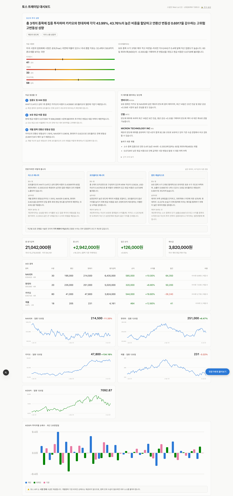
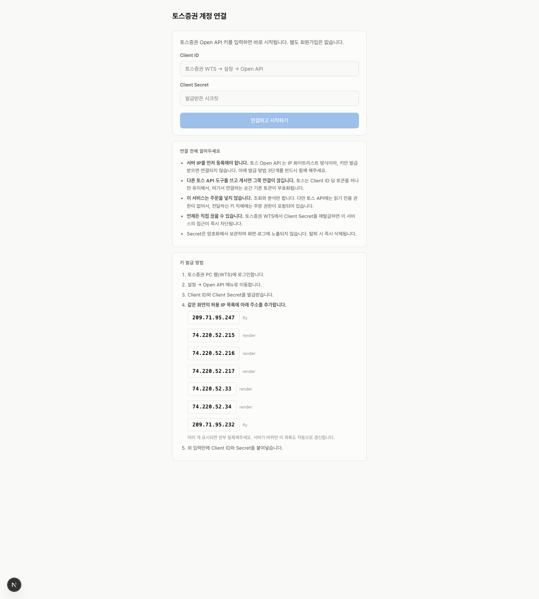

# 토스 트레이딩 분석 대시보드

토스증권 Open API로 내 계좌를 읽어, **뉴스·커뮤니티 여론·기관 보유(13F)·공포탐욕지수**를
모아 포트폴리오를 분석하는 개인용 대시보드. 시세만 보여주는 HTS와 달리
"남들이 이 종목을 뭐라고 하는가"와 "내 포트폴리오의 구조적 위험"을 짚어준다.


> ⚠️ **투자 자문이 아니라 개인용 분석 도구입니다.** 가격을 예측하지 않고,
> 매매를 지시하지 않습니다. 판단과 책임은 본인에게 있습니다.
> 각자 자기 기기에서 자기 키로 돌리는 **BYOK(Bring Your Own Key)** 구조라,
> 자격증명이 본인 환경을 떠나지 않습니다.

## 스크린샷

<p align="center">
  
  <br/><sub>대시보드 — 전략 진단 · 전문가 3관점 · 포트폴리오 · 시세 차트 · 투자자별 수급.
  <b>위 화면은 데모 데이터이며, 실제 계좌 정보가 아닙니다.</b> 헤더의 <code>🔒 잔고 숨김</code>으로 금액을 가릴 수 있습니다.</sub>
</p>

<p align="center">
  
  <br/><sub>온보딩 — 토스 Open API 키만 넣으면 검증 · 저장 · 수집이 자동으로 이어진다.</sub>
</p>

## 무엇을 보여주나

- **포트폴리오 진단** — 집중도(HHI)·변동성·베타·최대낙폭·승률을 코드로 계산
- **전문가 3관점** — 리스크매니저·PM·퀀트가 같은 데이터를 다르게 읽어준다
- **리밸런싱 제안** — 목표 비중은 규칙으로 계산, ETF·종목 후보는 실재하는 것만
- **여론 분석** — 뉴스·Reddit·유튜브·네이버뉴스를 Gemini로 감성 분류
- **기관 보유(SEC 13F)** — 내 미국 종목을 어떤 운용사가 담고 있는지
- **공포탐욕지수** — CNN·크립토 + 국내 자체 산출
- **대화형 상담** — 내 실제 숫자를 근거로 질문에 답 (예측·권유는 안 함)

## 설계 원칙

- **숫자는 코드가, 서술은 LLM이.** 수익률·비중·변동성을 LLM이 지어내지 않게
  전부 SQL로 계산해 넘긴다. LLM은 그걸 해석·설명만 한다.
- **가격 예측 금지.** "오를까요?"에 "오릅니다"라고 답하는 순간 신뢰가 무너진다.
- **추천 후보는 DB에 실재하는 종목만.** LLM이 상장폐지 종목이나 없는 티커를
  지어내면 코드가 걸러낸다.
- **주문은 차단이 기본.** `ALLOW_ORDERS` 미설정 시 주문 경로가 막힌다.

## 구성

```
web/        Next.js 대시보드 + 온보딩         → Vercel (또는 로컬)
worker/     Python 수집·분석 스케줄러          → 로컬 / Fly.io
            └ 토스 시세·계좌 · RSS · DART · SEC 13F · Gemini 분석
Neon Postgres + TimescaleDB(hypertable) + pgcrypto(자격증명 암호화)
```

## 시작하기 (로컬)

### 1. 준비물

- Python 3.11+, Node.js 20+, PostgreSQL(Neon 무료 티어 권장)
- **토스증권 Open API 키** — 토스증권 WTS → 설정 → Open API
  - ⚠️ 토스는 **IP 화이트리스트** 방식이다. 이 도구를 돌리는 기기의
    공인 IP를 토스 허용 IP에 등록해야 한다.
- **Gemini API 키** — https://aistudio.google.com/apikey (무료 티어 있음)
- (선택) DART, 네이버 검색 API 키

### 2. 설치

```bash
git clone https://github.com/choigod1023/toss-dashboard
cd toss-dashboard

# 마스터 키 생성 (한 번만 — 바꾸면 저장된 자격증명을 못 읽는다)
python3 worker/crypto.py --genkey >> .env
# .env 에 GEMINI_API_KEY, DATABASE_URL 등을 마저 채운다
cp .env.example .env    # 이미 있으면 편집만
chmod 600 .env

pip install -r requirements.txt
cd web && npm install && cd ..
```

### 3. DB 초기화

```bash
python3 worker/db/apply.py        # 스키마 생성
```

### 4. 실행

```bash
# 대시보드
cd web && npm run dev              # localhost:3100

# 워커 (다른 터미널)
python3 worker/main.py run         # 스케줄러 상주
```

### 5. 온보딩

`localhost:3100/onboard` 에서 토스 키를 넣으면 검증·저장·수집이 자동으로 이어진다.
자격증명은 **DB에 pgcrypto로 암호화** 저장되고, 화면·로그에 노출되지 않는다.
언제든 토스 WTS에서 Client Secret을 재발급하면 이 도구의 접근이 즉시 끊긴다.

## 배포 (선택)

- **대시보드 → Vercel**: `web/` 를 연결. `DATABASE_URL` 등 환경변수 등록.
- **워커 → Fly.io**: 토스 IP 화이트리스트 때문에 고정 outbound IP 가 필요하다.
  자세한 절차와 함정은 [`FLY.md`](FLY.md), 구성 개요는 [`DEPLOY.md`](DEPLOY.md).

## 알아둘 제약 (실측)

- 토스 Open API는 **웹소켓이 없다** — REST 폴링만. 초저지연 매매는 불가.
- 토큰은 **client당 1개** — 여러 도구를 동시에 쓰면 서로를 무효화한다.
- 미국 지수(S&P500 등)·개별종목 수급·섹터는 토스 API에 없다 — 일부는 외부 소스로 보완.
- Neon 무료 티어는 512MB — 원시 틱은 저장하지 않고 캔들·집계만 보관한다.
- 감성분석의 주가 예측력은 학술적으로 논쟁적이다 — 신호가 아니라 참고로 볼 것.

## 라이선스

MIT. 개인 학습·사용 목적. 이 도구로 인한 투자 손실에 대해 제작자는 책임지지 않는다.

---

## 👤 기여도 & 개발 환경

| 항목 | 내용 |
|---|---|
| **기여 비율** | **100%** (단독 개발) |
| **커밋** | 13 / 13 (본인 / 전체 사람 커밋) |
| **참여 인원** | 1명 |
| **AI 코딩 도구** | Claude Code |

<sub>기여 비율은 커밋 author 이메일 기준 집계이며 봇·자동화 커밋은 제외했습니다.</sub>
